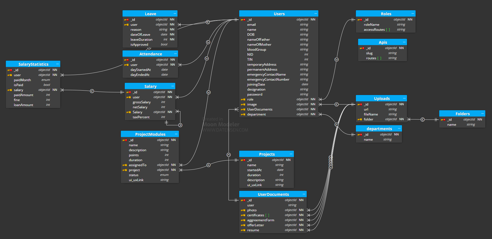

<h1 align="center">
    Employee management system
</h1>

# Features

The system may consists of below features:

- Department create
- Employee registration
- Employee login,
- Role based users (admin, HR, employee) with access routes
- Online attendance
- Leave request
- Project & task management
- Upload documents
- Payroll management
- Perfomance management

# Technologies

- Backend
  - Nodejs
  - Expressjs
  - JWT
  - Multer (File uploading)
  - Winston
  - Joi (Input validation)

- Database
  - MongoDB
  - Mongoose (driver)

- Testing
  - Jest
  - Supertest
  - MongoDB memory server

- Devops
  - Docker file
  - Docker compose
  - Github actions

- Frontend
  - React
  - React-router-dom
  - Swr
  - React context hook
  - Ant Design
  - Tailwind CSS
  - PWA

# Database Design

- Departments
  - _id (string)
  - name (string)
  - createdAt (date)
  - updatedAt (date)

- Roles
  - _id (string)
  - roleName (string) unique
  - accessRoutes (Array of string)
  - createdAt (date)
  - updatedAt (date)

- Api
  - _id (string)
  - slug (string) unique
  - routes (array of strings)
  - createAt (date)
  - updatedAt (date)

- Folders
  - _id (string)
  - name (string) unique
  - createdAt (string)
  - updatedAt (string)

- Uploads
  - _id (string)
  - url (string)
  - fileName (string)
  - folder (string of Folder _id)
  - createdAt (string)
  - updatedAt (string)

- Users
  - _id (string)
  - email (string) unique
  - name (string)
  - department (string of Department _id)
  - DOB (string) unique
  - nameOfFather (string)
  - nameOfMother (string)
  - bloodGroup (string)
  - NID (number) unique
  - TIN (number) unique
  - temporaryAddress (string)
  - permanentAddress (string)
  - emergencyContactName (string)
  - emergencyContactNumber (string)
  - joiningDate (date)
  - image (string of Upload _id)
  - designation (string)
  - role (string of Role _id)
  - documents (string of UserDocuments _id)
  - password (string)
  - createdAt (date)
  - updatedAt (date)

- Attendance
  - _id (string)
  - user (string of User _id)
  - dayStartedAt (datetime)
  - dayEndedAt (datetime)
  - createdAt (date)
  - updatedAt (date)

- Leave
  - _id (string)
  - user (string of User _id)
  - reason (string)
  - dateOfLeave (date)
  - leaveDuration (number)
  - isApproved (boolean)
  - createdAt (date)
  - updatedAt (date)

- Salary
  - _id (string)
  - user (string of User _id)
  - grossSalary (number)
  - netSalary (number)
  - taxPercent (number)

- SalaryStatistics
  - _id (string)
  - user (string of User _id)
  - paidMonth (string)
  - isPaid (string)
  - salary (string of Salary _id)
  - paidAmount (number)
  - fine (number)
  - loanAmount (number)

- UserDocuments
  - _id (string)
  - user (string of User _id)
  - photo (string)
  - certificates (array of string)
  - agreementForm (string)
  - offerLetter (string)
  - resume (string)
  - createdAt (date)
  - updatedAt (date)

- Projects
  - _id (string)
  - name (string)
  - description (string)
  - ui_uxLink (string)
  - startedAt (date)
  - duration (number) //in months
  - modules

- ProjectModules
  - _id (string)
  - name (string)
  - description (string)
  - points (number)
  - duration (number) // in days
  - assignedTo (string of User _id)
  - project (string of Project _id)
  - status (string of enums) // Todo, InProgress, ReadyToQA, Done
  - uiLink (string)
  - createdAt (date)
  - updatedAt (date)

